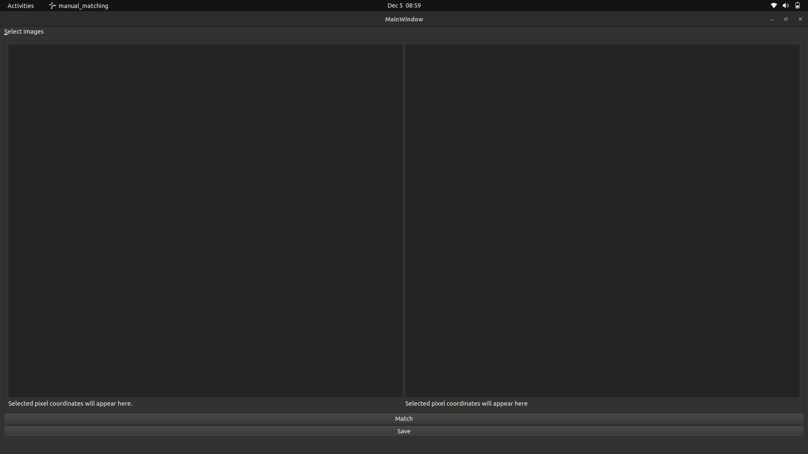
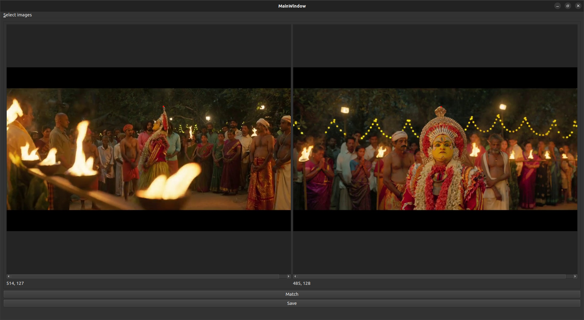

# About

This is a very basic tool to help you manually choose feature matches between
two images. The output is saved as a csv file with the format `x1, y1, x2, y2`,
where `(x1, y1)` is the location of the feature in the first image and `(x2,
y2)` is the location of the feature in the second image.

# Steps
1. Using the "Select images" menu item, open a pair of images of the same scene .
2. Click on the selected feature in the first image and then click on the same
   feature in the second image. An unsaved feature appears in red (tip of the
   crown in this example). .
3. Record the two pixel locations as a match using the "Match" button. A
   recorded match appears in white. 
4. Repeat steps 2 and 3 for all pairs you want to record. Try to match features
   that are at different depths in the scene for better performance in
   downstream 3D algorithms.
5. Click on the "Save" button to save all matched pairs to a csv file.
